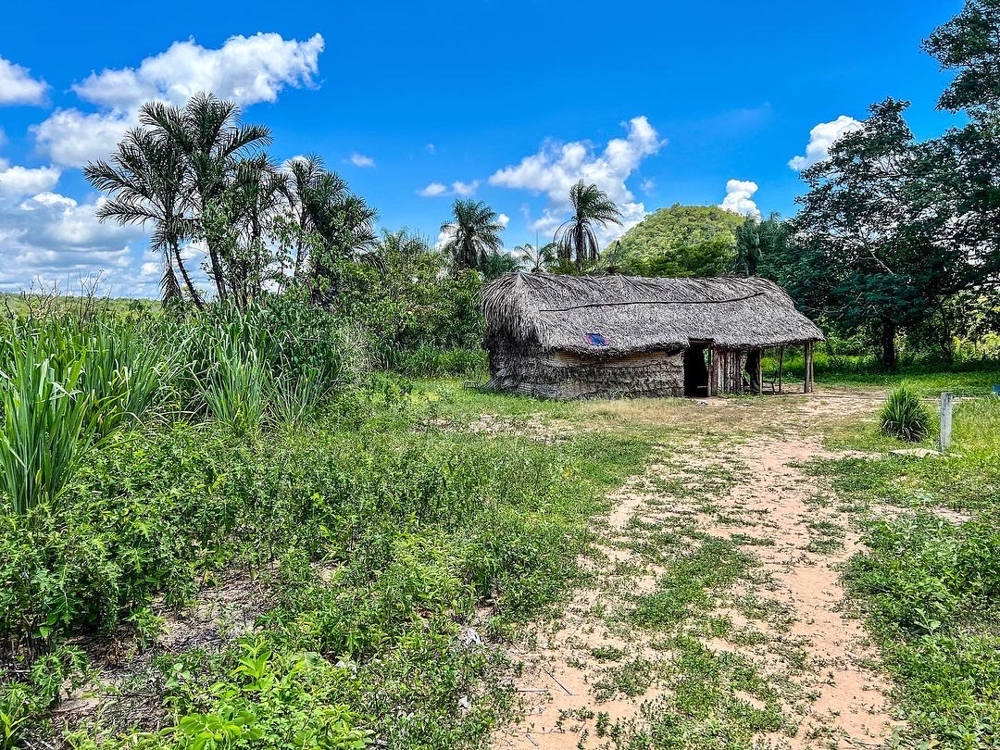
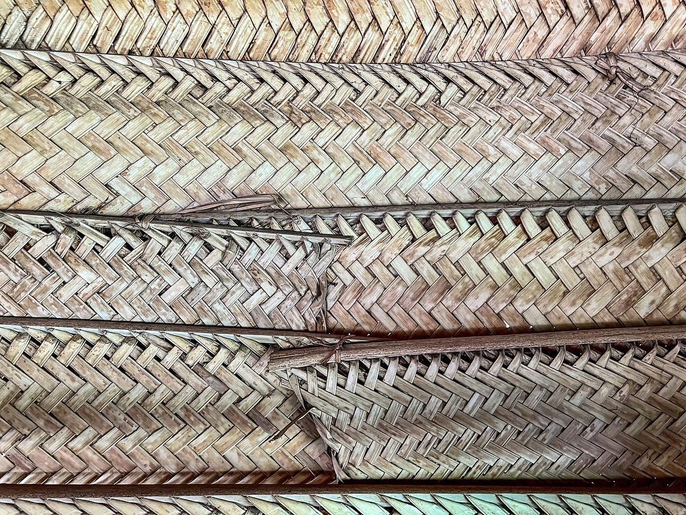
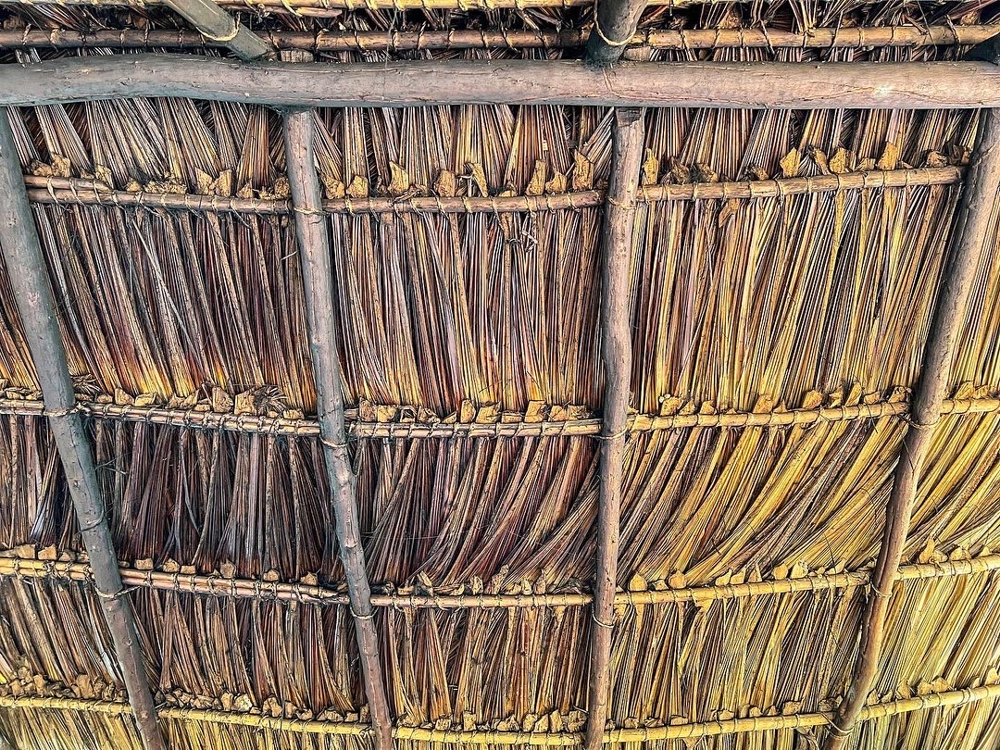

Português:

 

# Bororo revitalization project

The Bororo language revitalization project has as its main objective to make the language spoken more frequently in the daily life of the community, both by adults and mainly by children, who are no longer speaking the language.

## Where ?

Initially, the work will be carried out in the [Meruri indigenous land](https://terrasindigenas.org.br/pt-br/terras-indigenas/3767)

 

<figure align="center" >
  
    <figcaption>Traditional Boror house. Photo: Fabrício Gerardi (Meruri, November 2022)</figcaption>
</figure>

 
 

## Who?

The Bororo revitalization project is a partnership between the Bororo community, represented by the teachers Kujibo (Mariel) Ekureu and Lauro Ekureu (Universidade de São Paulo), together with Fabrício Ferraz Gerardi (University of Tübingen), Carolina Aragon (Universidade Federal University of Paraíba), Tiago Tresoldi (University of Uppsala), Tim Wientzek (University of of Tübingen), and Father Tiago Figueiró (SDB).

 

<figure align="center">
  
   <figcaption>Internal wall of a traditional Bororo house. Photo: Fabrício Gerardi (Meruri, November 2022)</figcaption>
</figure>

 
 

## What do we plan?

* Reference grammar of the Bororo langauage (English and Portuguese version, online and in print)
* Bororo dictionary (online version available in CLDF)
* Proposal of an orthography for the Bororo language
* School books in Bororo (various grades)
* Modernization of school material
* [UD Bororo treebank](https://github.com/UniversalDependencies/UD_Bororo-BDT/tree/dev) with myths, stories, fieldwork material, and other texts (English and Portuguese translations)
* Workshops with and for the comunity
* Promotion of Bororo culture

 

<figure align="center" >
  
    <figcaption>Roof of a traditional Bororo house. Photo: Fabrício Gerardi (Meruri, November 2022)</figcaption>
</figure>

 
 

---
